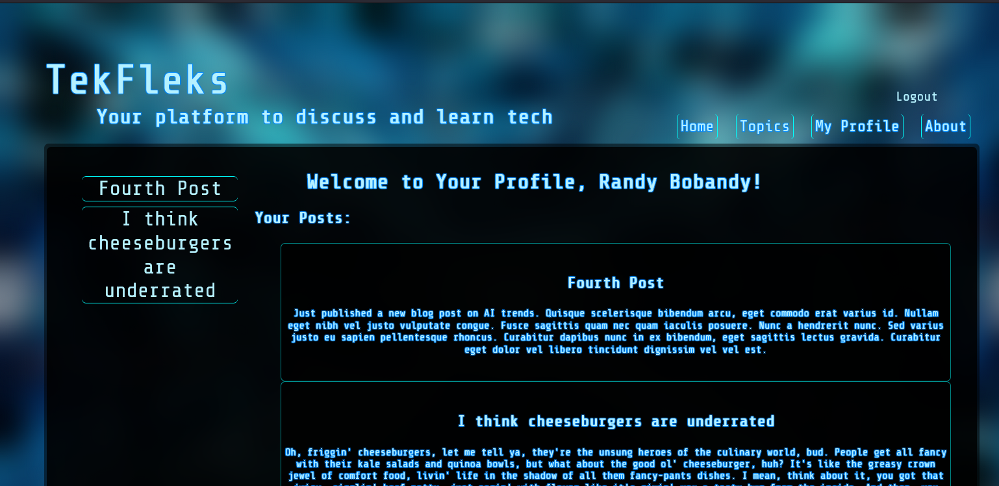

# TekFleks

## Table of Contents
 - [Description](#description)
 - [Installation](#installation)
 - [Usage](#usage)
 - [Credits](#credits)
 - [Testing](#testing)
 - [Contact](#contact)
 - [License](#license)

## Description
TekFleks is a blog forum front and back-end, geared toward making it fun, engaging and easy for people to share information and tutorials on various technologies.     

## Installation
Run 'npm install' to install dependencies, then fill in your environment variables. Fire up mysql, and run "source ./db/schema.sql" to set up the database, and in terminal run 'npm run seed' if you would like seed data.

## Usage
Simply set it up or deploy to heroku with JAWSDB and either heroku will use the provided DYNO in the Procfile to start it or alternatively - if running locally - run 'npm run watch' in the terminal. IF DEPLOYING ON HEROKU: You must run a seed file for at least TOPICS, using heroku's bash console. Just use the more button in the corner of the project dashboard on heroku and choose run console, then type bash in the following input box, The project is setup over here at this link if you would like to check it out ==> https://tekfleks-c6410a448c68.herokuapp.com/

## Credits
The teachers, TAs, and yet another ginormous bottle of coffee.

## Testing
Use Beekeeper Studio, Workbench or whatever program you
 would like to test the back-end. Otherwise head to the website above ^

- GitHub Profile: [IkonicRes](https://github.com/IkonicRes)

- For additional questions, reach out to IkonicResonance@gmail.com.

## Contact

Preferred method of communication: Github

## License
